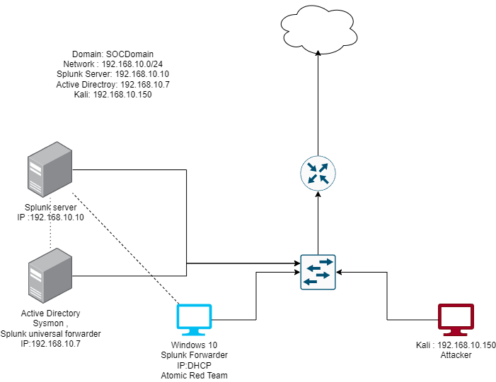

# Splunk-Kali-AD-LAB

## Overview

This repository contains the setup instructions and network diagram for the Soclab environment. Soclab is a lab environment designed for practicing and testing various security operations and incident response (SOAR) scenarios. The lab setup includes the following components:

- Kali Linux: A penetration testing distribution used for conducting security assessments and penetration testing.
- Windows Active Directory: A Windows Server environment configured with Active Directory services for user authentication and centralized management.
- Ubuntu Server: A Linux-based server hosting Splunk, a security information and event management (SIEM) platform used for log management, analysis, and threat detection.
- Network Diagram: A visual representation of the network topology and connectivity between the different components in the Soclab environment.

## Network Diagram

The network diagram above illustrates the architecture of the Soclab environment. It includes the following components:

- Kali Linux: A virtual machine (VM) running the Kali Linux distribution, used for penetration testing and security assessments.
- Windows Active Directory: A Windows Server VM configured with Active Directory services, including two user accounts (Yash and Hireme) for user authentication and administration.
- Leto-pc: A Windows client machine joined to the Active Directory domain.
- Ubuntu Server: A Linux-based server VM hosting Splunk Enterprise for log management and security monitoring.

## Setup Instructions

### Prerequisites

Before setting up the Soclab environment, make sure you have the following prerequisites:

- VirtualBox: Install VirtualBox, a free and open-source virtualization platform, on your host machine.
- Virtual Machine Images: Download the necessary virtual machine images for Kali Linux, Windows Server (with Active Directory), and Ubuntu Server with Splunk pre-installed.
- Network Configuration: Configure VirtualBox to set up a virtual network for the Soclab environment, including network adapters and DHCP settings.

### Installation Steps

1. Import Virtual Machines: Import the downloaded virtual machine images into VirtualBox.
2. Configure Network Settings: Set up network adapters for each virtual machine and configure IP addresses, subnet masks, and gateway settings according to the network diagram.
3. Start Virtual Machines: Start the virtual machines in the following order: Windows Active Directory, Ubuntu Server, Kali Linux, and Leto-pc.
4. Verify Connectivity: Test connectivity between the different components in the Soclab environment, including Active Directory authentication and Splunk data ingestion.

## Usage

Once the Soclab environment is set up, you can use it for various security-related tasks, including:

- Penetration testing and vulnerability assessments with Kali Linux.
- User authentication and group policy management with Windows Active Directory.
- Log management, analysis, and threat detection with Splunk Enterprise.

## Contribution

Contributions to this repository are welcome! If you have suggestions for improving the Soclab setup instructions or network diagram, please open an issue or submit a pull request.

## License

This project is licensed under the [MIT License](LICENSE).
